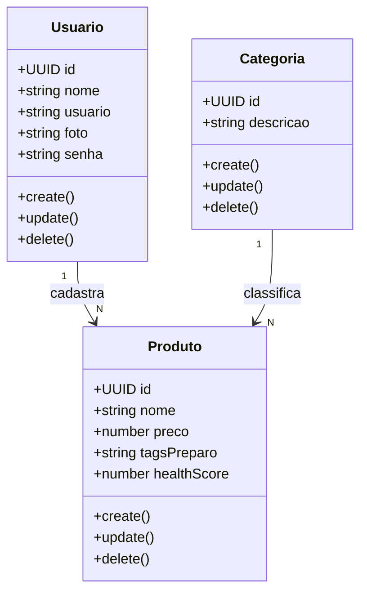
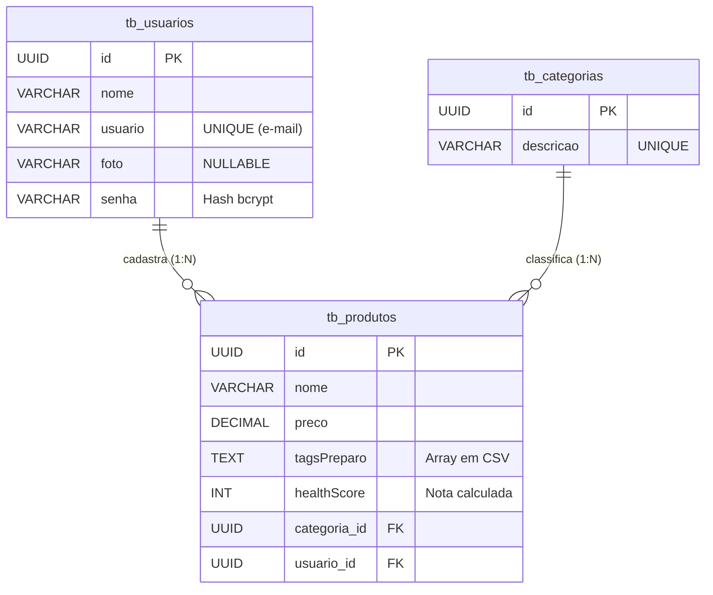

# 🍽️ River Food - Backend

<div align="center">


</div>

---

## 📌 1. Descrição

O **River Food** é uma plataforma de delivery inteligente com foco em alimentação saudável 🥗.

A proposta do sistema é permitir que usuários façam escolhas mais conscientes, disponibilizando **informações nutricionais claras** — indo além da aparência dos alimentos.

---

## 🚀 2. Sobre a API

A API do River Food é responsável pelo gerenciamento completo dos dados da aplicação, seguindo o padrão **MVC orientado a serviços**, garantindo:

- Organização
- Escalabilidade
- Segurança

---

### ⚙️ 2.1 Funcionalidades

✔️ CRUD de usuários  
✔️ CRUD de categorias  
✔️ CRUD de produtos  
✔️ Classificação automática (**HealthScore**)  
✔️ Listagem inteligente de produtos  
✔️ Filtros por faixa de preço  
✔️ Gerenciamento de tags nutricionais  

---

### 📏 2.2 Regras de Negócio

- 📌 Todo produto deve possuir uma categoria  
- 📌 Cada produto deve ter no mínimo **3 tags válidas**  
- 📌 Não é permitido duplicar tags  
- 📌 Cada produto pertence ao usuário que o cadastrou  

---

## 🧠 3. Diferencial do Sistema

O grande destaque do River Food é o **HealthScore** 🏆

Sistema que classifica os alimentos com base nas suas características nutricionais:

| Classificação | Significado        |
|--------------|-------------------|
| 🟢 A         | Muito saudável     |
| 🟡 B / C     | Moderado           |
| 🔴 D / E     | Consumo ocasional  |

👉 Isso ajuda o usuário a tomar decisões mais conscientes na hora de pedir comida.

---

## 🗂️ 4. Modelagem do Sistema

### 📊 Diagrama de Classes


---

### 🧩 Diagrama Entidade-Relacionamento (DER)


---

## 🛠️ 5. Tecnologias Utilizadas

| Tecnologia     | Descrição                     |
|----------------|-----------------------------|
| Node.js        | Ambiente de execução         |
| TypeScript     | Linguagem principal          |
| NestJS         | Framework backend            |
| TypeORM        | ORM                          |
| PostgreSQL     | Banco de dados (Neon)        |

---

## 🗃️ 6. Estrutura do Banco

### 🍔 Produto

| Campo        | Tipo     | Descrição               |
|--------------|---------|------------------------|
| id           | INT     | Identificador          |
| nome         | VARCHAR | Nome do produto        |
| descricao    | VARCHAR | Descrição              |
| preco        | DECIMAL | Preço                  |
| imgUrl       | VARCHAR | URL da imagem          |
| tagsPreparo  | VARCHAR | Tags nutricionais      |
| healthScore  | INT     | Classificação de saúde |
| categoriaId  | INT     | FK Categoria           |
| usuarioId    | INT     | FK Usuário             |

---

### 🗂️ Categoria

| Campo      | Tipo         | Descrição           |
|------------|--------------|--------------------|
| id         | INT          | Identificador       |
| descricao  | VARCHAR(255) | Nome da categoria   |

---

### 👤 Usuário

| Campo    | Tipo         | Descrição        |
|----------|--------------|------------------|
| id       | INT          | Identificador    |
| nome     | VARCHAR(255) | Nome             |
| usuario  | VARCHAR(255) | Email/Login      |
| senha    | VARCHAR(50)  | Senha            |

---

## 🔮 7. Melhorias Futuras

- 💳 Integração com pagamento  
- 📍 Rastreamento em tempo real  
- 🤖 Recomendação com IA  
- 🍽️ Customização de pratos  
- 📈 Sugestões inteligentes (upsell)  

---

## ⚡ 8. Como Executar

```bash
# Clone o repositório
git clone <url-do-repositorio>

# Entre na pasta
cd river-food-backend

# Instale as dependências
npm install

# Configure o .env (banco de dados)

# Execute o projeto
npm run start:dev
